# Valhalla Act 2 / EmberRoot — Scene Progression Map

This Mermaid diagram checks transfer alignment across the three import batches:

1. Control systems
2. People / places / enemies
3. Session dossier / branches / micro encounters

```mermaid
flowchart TD
  %% Valhalla Act 2 / EmberRoot Scene Progression
  %% Focus: top-down session spine, branching investigations, major choices, and consequence flow.

  START([Act 2 Begins<br/>Emberfall / The Ashen Root]) --> S1

  subgraph S1G["Session 1 — The City Burns"]
    S1["Bifrost Drop Into Emberfall<br/>Too hot, too steep, too late"] --> S1P0["Phase 0: Arrival Shock<br/>Ask: Who are you going for?"]
    S1P0 --> S1P1["Phase 1: Control Attempt<br/>2–3 solvable problems"]
    S1P1 --> S1P2["Phase 2: System Failure<br/>Unchosen objective fails"]
    S1P2 --> S1P3["Phase 3: Multi-Front Crisis<br/>Civilians / Structure / Fire"]
    S1P3 --> S1P4["Phase 4: Partial Stabilization<br/>Help is real; loss has shape"]
    S1P4 --> S1END["Emotional Button<br/>“...for some of us.”"]
  end

  S1END --> S2

  subgraph S2G["Session 2 — The Breaking Point"]
    S2["After the Fire<br/>Reaction → Investigation"] --> S2P0["Phase 0: Assessment<br/>Let confusion exist"]
    S2P0 --> THREADS{"Choose Investigation Threads"}

    THREADS --> A["Thread A — System Failure<br/>Systems fail independently"]
    THREADS --> B["Thread B — Fire Giant Interference<br/>Giants exploit, not cause"]
    THREADS --> C["Thread C — Root Resonance<br/>Root amplifies, not corrupts"]

    A --> MATRIX["Outcome Matrix / Insight Read"]
    B --> MATRIX
    C --> MATRIX

    MATRIX --> AONLY["A only<br/>Think system is failing"]
    MATRIX --> BONLY["B only<br/>Think giants are cause"]
    MATRIX --> CONLY["C only<br/>Think Root is cause"]
    MATRIX --> AB["A + B<br/>Blame giants + system"]
    MATRIX --> AC["A + C<br/>Begin understanding truth"]
    MATRIX --> BC["B + C<br/>Misattribute cause"]
    MATRIX --> ABC["A + B + C<br/>Near full realization, but late"]
    MATRIX --> CBA["C → B → A<br/>Optimal Route"]

    AONLY --> S2SHIFT
    BONLY --> S2SHIFT
    CONLY --> S2SHIFT
    AB --> S2SHIFT
    AC --> S2SHIFT
    BC --> S2SHIFT
    ABC --> S2SHIFT
    CBA --> OPTIMAL["Maximal Optimal State<br/>Root = amplifier<br/>Giants = opportunists<br/>System = failing under load"]

    OPTIMAL --> EARLYCORE["Early Core Read possible<br/>“This isn’t the enemy.”"]
    EARLYCORE --> S2SHIFT

    S2SHIFT["Phase 2: Realization Shift<br/>Not one thing. Everything."] --> S2DESCENT["Phase 3: Descent Hook<br/>Kaldra: “If you want answers… they’re below.”"]
    S2DESCENT --> S2END["Entrance to the Core Furnace<br/>Heat is closer; something is building"]
  end

  S2END --> S3

  subgraph CLOCKG["Clock-Based Escalation Overlay"]
    CLOCK0["Clock 0–1<br/>Maneuverable pressure"]
    CLOCK2["Clock 2<br/>Bridge collapse<br/>Minor casualties"]
    CLOCK4["Clock 4<br/>District destroyed<br/>Valkyries visibly strained"]
    CLOCK6["Clock 6<br/>Core spike<br/>Council urgency immediate<br/>No downtime"]
    CLOCK0 --> CLOCK2 --> CLOCK4 --> CLOCK6
  end

  MATRIX -. "thread exploration / delay increases Clock" .-> CLOCK2
  S2DESCENT -. "Clock affects Forge Below, Council, Unsavable" .-> CLOCKG

  subgraph S3G["Session 3 — Forge Below / Living Core"]
    S3["Core Furnace Descent<br/>The Core is not the enemy"] --> S3LOOP["System Crisis Loop<br/>Core reacts → Giants act → Players choose → Update Stability"]
    S3LOOP --> PRIORITY{"Player Priority"}
    PRIORITY --> STABILIZE["Stabilize System<br/>Improve Core State"]
    PRIORITY --> GIANTS["Stop Giants<br/>Prevent pillar / chain damage"]
    PRIORITY --> CORE["Engage Core<br/>Gain truth / progress<br/>Risk instability"]

    STABILIZE --> STRIKECHECK{"Skarth Strike Team Trigger?"}
    GIANTS --> STRIKECHECK
    CORE --> STRIKECHECK

    STRIKECHECK -->|Players stabilize or hesitate| STRIKE["Break the Chains<br/>Magma Reaver + Cinder Channeler"]
    STRIKECHECK -->|No trigger yet| CORESTATE["Set Core State<br/>Stable / Mixed / Unstable"]

    STRIKE --> STRIKETIMER["Strike Team Timer<br/>R1 Arrive → R2 Destabilize → R3 Partial Rupture → R4 Catastrophic Break"]
    STRIKETIMER --> STRIKECHOICE{"Player Response"}
    STRIKECHOICE --> STOP["Stop Them<br/>Prevent escalation<br/>Clock +1"]
    STRIKECHOICE --> OUTMANEUVER["Outmaneuver Them<br/>Reduce damage<br/>Partial failure"]
    STRIKECHOICE --> IGNORE["Ignore Them<br/>Faster progress<br/>Massive instability spike"]

    STOP --> CORESTATE
    OUTMANEUVER --> CORESTATE
    IGNORE --> CORESTATE

    CORESTATE --> S3END["Transition to Council<br/>The system reacts to your choices"]
  end

  S3END --> S4

  subgraph S4G["Session 4 — The Choice / Molten Council"]
    S4["Molten Council<br/>Inputs: Insight + Core State + Clock"] --> TONE["Council Tone<br/>Low Insight = confusion<br/>Mid = tradeoffs<br/>High = mitigation<br/>Stable = debate<br/>Unstable = panic"]
    TONE --> SKARTHACC["Skarth Accusation → Reframe → Temptation<br/>He does not deny. He says: Yes. And?"]
    SKARTHACC --> CHOICE{"The Choice"}

    CHOICE --> REINFORCE["Reinforce<br/>Hold it together<br/>Ragnarok +2"]
    CHOICE --> SHUTDOWN["Shutdown<br/>Reduce load<br/>Ragnarok +1"]
    CHOICE --> COLLAPSE["Collapse<br/>Save people first<br/>Ragnarok +2"]
    CHOICE --> RELEASE["Release<br/>Let power grow<br/>Ragnarok +3"]

    SKARTHACC --> SKARTHCOND{"Join Skarth Branch Available?"}
    SKARTHCOND -->|High Insight + Sympathy + Questioned Control| OFFER["Skarth: “Help me.”<br/>GM safety: This will make things worse for the city."]
    SKARTHCOND -->|Not earned| CHOICE
    OFFER --> SKARTHDECIDE{"Player Decision"}
    SKARTHDECIDE --> OPPOSE["Oppose Skarth"] --> CHOICE
    SKARTHDECIDE --> IGNORE_SK["Ignore Skarth"] --> CHOICE
    SKARTHDECIDE --> HELP_SK["Help Skarth<br/>Philosophical alignment path<br/>Not evil / not failure"]

    HELP_SK --> JOINSHIFT["Objective Flips<br/>Stabilize → Break containment faster<br/>Destroy pillar / disrupt stabilization / protect strike team"]
    JOINSHIFT --> RUNAWAY["Runaway Transformation Added<br/>+1 crisis<br/>Fire behaves like living force"]
  end

  REINFORCE --> S5
  SHUTDOWN --> S5
  COLLAPSE --> S5
  RELEASE --> S5
  RUNAWAY --> S5

  subgraph S5G["Session 5 — The Unsavable / Hot Exfil"]
    S5["The Unsavable Begins<br/>“You chose what to save. Now watch what you didn’t.”"] --> SETUP["Pre-Session Variables<br/>Insight + Core State + Clock"]
    SETUP --> CRISISCOUNT{"Crisis Count"}
    CRISISCOUNT -->|Clock 0–2| C3["3 Crises"]
    CRISISCOUNT -->|Clock 3–4| C4["4 Crises"]
    CRISISCOUNT -->|Clock 5–6| C5["5+ Crises + chain events"]

    C3 --> CRISES
    C4 --> CRISES
    C5 --> CRISES

    CRISES{"Pick Crisis Set<br/>Players fully resolve 1<br/>or 2 with High Insight"} --> CIV["Crisis 1: Civilian Surge<br/>Trapped people"]
    CRISES --> STRUCT["Crisis 2: Structural Collapse<br/>Critical route failing"]
    CRISES --> LAVA["Crisis 3: Lava Breach<br/>Containment line gone"]
    CRISES --> ENEMY["Crisis 4: Enemy Push<br/>Giants / constructs exploit chaos"]
    CRISES --> FLARE["Crisis 5: Core Flare<br/>The Core reacts"]
    CRISES -->|If Join Skarth| TRANS["Optional Crisis: Runaway Transformation<br/>Environment mutates"]

    CIV --> RESOLVE{"Chosen crisis resolved?"}
    STRUCT --> RESOLVE
    LAVA --> RESOLVE
    ENEMY --> RESOLVE
    FLARE --> RESOLVE
    TRANS --> RESOLVE

    RESOLVE -->|Chosen| SUCCESS["Full or partial success<br/>Chosen objective matters"]
    RESOLVE -->|Ignored| CASCADE["Consequence Cascade<br/>Ignored crises resolve without them"]

    SUCCESS --> EXFILBUILD
    CASCADE --> EXFILBUILD

    EXFILBUILD["Build Hot Exfil<br/>Resolved crises = benefits<br/>Unresolved crises = hazards"] --> EXFILTYPE{"Core State"}
    EXFILTYPE -->|Stabilized| EXSTABLE["Predictable routes<br/>Fewer hazards"]
    EXFILTYPE -->|Mixed| EXMIXED["Shifting terrain"]
    EXFILTYPE -->|Unstable| EXUNSTABLE["Constant hazards<br/>Collapsing paths"]

    EXSTABLE --> FINAL
    EXMIXED --> FINAL
    EXUNSTABLE --> FINAL

    FINAL["Final Escape<br/>The light takes you — not cleanly, not gently"]
    FINAL --> BUTTON["Emotional Button<br/>“It’s still burning…”"]
  end

  BUTTON --> AFTER([Return to Valhalla / Fallout<br/>Ragnarok advances<br/>Valkyrie strain visible<br/>Quiet consequences follow])

  %% Micro encounter pools
  subgraph MICRO["Drop-In Micro Encounter Pool"]
    HF["High Forge<br/>Hold the Line<br/>Control Room Lie"]
    MW["Midworks<br/>Argument at the Node<br/>Overload Cascade"]
    CW["Chainways<br/>Blocked Crossing<br/>The Fall"]
  end

  HF -. can appear during .-> S1P3
  HF -. can appear during .-> S2P0
  MW -. can appear during .-> A
  MW -. can appear during .-> S2P0
  CW -. can appear during .-> S1P3
  CW -. can appear during .-> S5

  %% Style hints
  classDef session fill:#1f2937,stroke:#f97316,color:#fff,stroke-width:2px;
  classDef choice fill:#3b0764,stroke:#d946ef,color:#fff,stroke-width:2px;
  classDef crisis fill:#7f1d1d,stroke:#ef4444,color:#fff,stroke-width:2px;
  classDef truth fill:#064e3b,stroke:#10b981,color:#fff,stroke-width:2px;
  classDef note fill:#111827,stroke:#94a3b8,color:#fff,stroke-dasharray: 5 5;

  class S1,S2,S3,S4,S5 session;
  class THREADS,PRIORITY,STRIKECHECK,STRIKECHOICE,CHOICE,SKARTHCOND,SKARTHDECIDE,CRISISCOUNT,CRISES,RESOLVE,EXFILTYPE choice;
  class CIV,STRUCT,LAVA,ENEMY,FLARE,TRANS,CASCADE crisis;
  class MATRIX,OPTIMAL,EARLYCORE,CORESTATE,TONE truth;
  class MICRO,HF,MW,CW,CLOCKG note;

```

